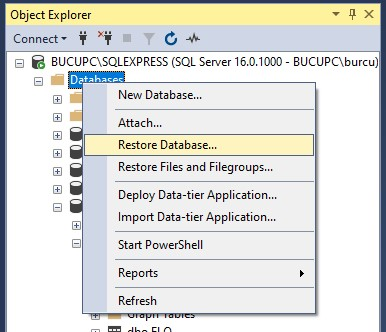
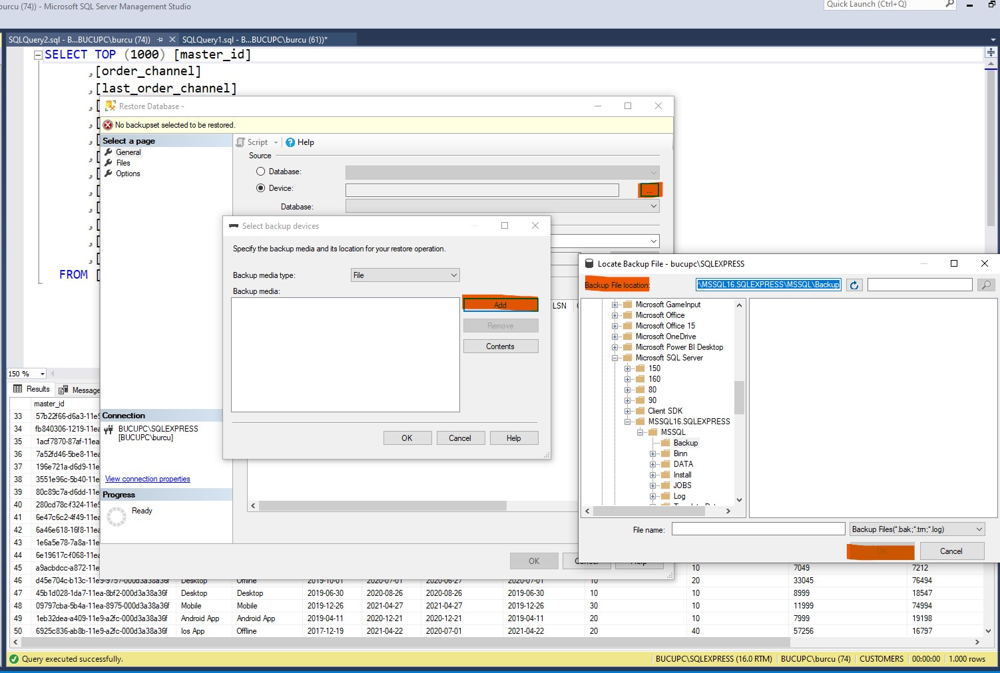
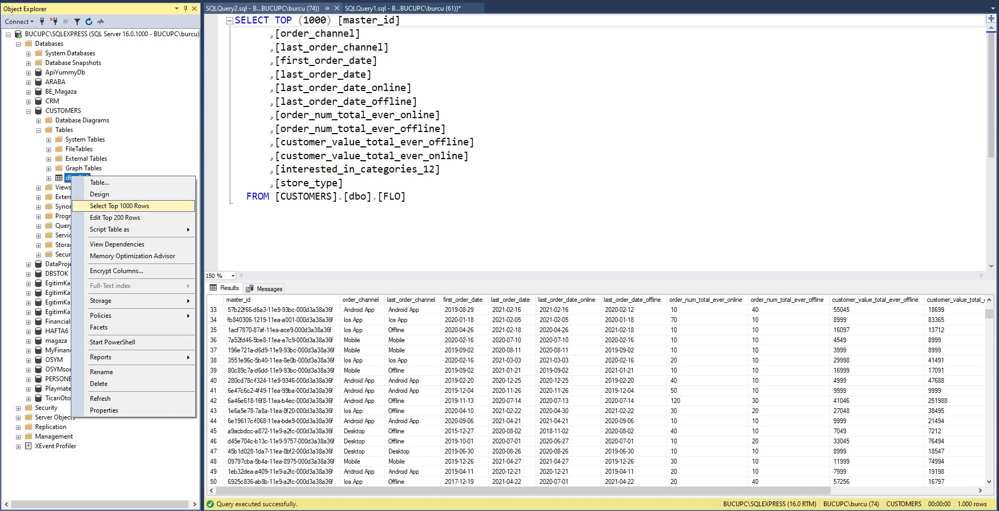

# QUERY-NG_MS_SQL
## 1. Veritabanı Oluşturma
Customers isimli bir veritabanı ve verilen veri setindeki değişkenleri içerecek FLO isimli bir tablo oluşturunuz

-Customers isimli veritabanını oluşturmak için aşağıdaki SQL komutu kullanıldı:

-Object Explorer üzerinden "Databases" sekmesine sağ tıklanır.
-Veri seti, CUSTOMERS veritabanı altına FLO tablosu olarak aktarılır.

-Restore Database... seçeneği seçilerek kaynak dosya yolu belirlenir.

-Veri seti, CUSTOMERS veritabanı altına FLO tablosu olarak aktarılır.

