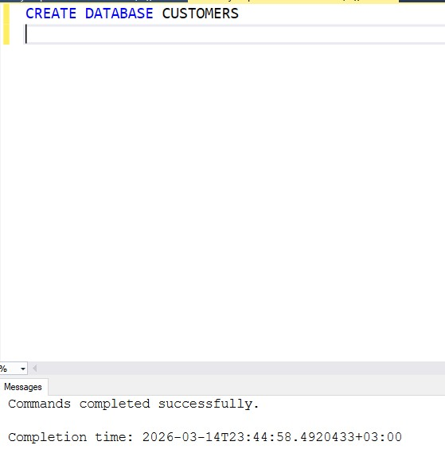

# QUERY-NG_MS_SQL
## 1. Veritabanı Oluşturma
Customers isimli bir veritabanı ve verilen veri setindeki değişkenleri içerecek FLO isimli bir tablo oluşturunuz

Customers isimli veritabanını oluşturmak için aşağıdaki SQL komutu kullanıldı:

